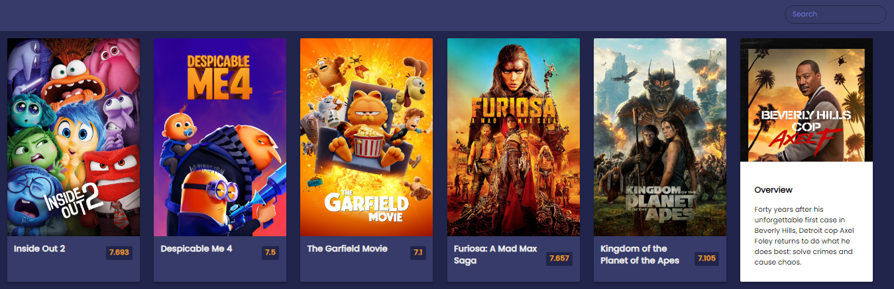

# Movie Mania

Movie Mania is a web application that allows users to discover popular movies and search for specific movies using the [TMDB API](https://developer.themoviedb.org/docs/getting-started).

## Table of Contents

- [Features](#features)
- [Screenshot](#screenshot)
- [Installation](#installation)
- [Usage](#usage)
- [Contributing](#contributing)
- [Credits](#credits)

## Features

- Display a list of popular movies.
- Search for movies by title.
- View movie details including the poster, rating, and overview.

## Screenshot



### Installation

1. Clone the repository:

   ```bash
   git clone https://github.com/amit712singhal/movie-mania.git
   ```

2. Navigate to the project directory:

   ```bash
   cd movie-mania
   ```

## Usage

- Open the index.html file in your web browser or simply checkout the deployed website under "About" section.
- The main page will display a list of popular movies fetched from the TMDB API.
- Use the search bar to find specific movies by their title.
- Click on a movie to view its details, including the poster, rating, and overview.

## Contributing

Contributions are welcome! If you'd like to contribute to the project, please follow these steps:

1. Fork the repository.
2. Create your feature branch (`git checkout -b feature/YourFeature`).
3. Commit your changes (`git commit -am 'Add some feature'`).
4. Push to the branch (`git push origin feature/YourFeature`).
5. Create a new Pull Request.

## Credits

This project was created as part of a [50 Projects in 50 Days Course](https://www.udemy.com/course/50-projects-50-days/) on Udemy. Credits go to Brad Traversy & Florin Pop for providing guidance and resources.
